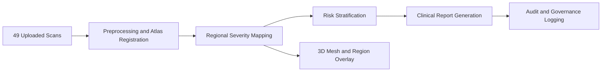

# Results Section Showcase Guide (PhD Poster)

## Purpose
This document defines exactly what to present under the Results section for the Brain_Scape research poster so the narrative is quantitative, clinically interpretable, and defensible.

Date prepared: 2026-04-19

Publication control note:
- For thesis/paper submission, treat `docs/PHD_PUBLICATION_VALIDATION.md` and `docs/publication_metrics_latest.json` as the authoritative source.
- Values below are synchronized to that validated cohort (49 publication-eligible scans from 71 detected analysis rows).

---

## 1. Results Storyline (Recommended Order)
1. Cohort snapshot: what data was processed and what outputs were generated.
2. Primary quantitative outcomes: confidence, triage, burden, severity counts.
3. Clinical interpretability: region-level prevalence and exemplar cases.
4. Operational deliverables: generated reports and 3D exports.
5. Governance outcomes: authorization behavior and audit evidence.
6. Limitations and boundaries: what is and is not claimed.

Keep this order to move from global performance to clinical and operational trustworthiness.

---

## 2. Must-Show Quantitative Blocks
### Block A: Cohort descriptor
Present these values:
- N analyzed scans: 49
- Modality split: MRI_T1 45, fMRI 4
- Atlas used: AAL3 (all 49)
- Scan quality labels: limited 26, fair 23
- Source type: uploaded 49

### Block B: Core output metrics
Show this table:
- Mean overall confidence: 0.723
- Mean triage score: 8.19
- Mean flagged regions: 3.12
- Mean severe regions: 1.06
- Mean flagged volume mm3: 6939.2
- Mean severe volume mm3: 3113.6
- Mean region confidence percent: 78.42
- Mean highest region burden percent: 25.39

### Block C: Risk stratification
- High: 23
- Moderate: 4
- Low: 22

Visual recommendation:
- Use a horizontal bar chart with High/Moderate/Low counts.

### Block D: Severity class distribution
- BLUE: 159 (40.56%)
- GREEN: 80 (20.41%)
- YELLOW: 67 (17.09%)
- ORANGE: 34 (8.67%)
- RED: 52 (13.27%)

Visual recommendation:
- Use stacked bar or donut chart with count and percent labels.

---

## 3. Clinical Interpretability Showcase
### Block E: Region prevalence (severity >= 2)
Show top affected regions:
- Precentral_R: 35 cases, mean burden 22.10%, mean volume 1525.7 mm3
- Hippocampus_R: 21 cases, mean burden 28.61%, mean volume 1865.7 mm3
- Parietal_Inf_L: 19 cases, mean burden 24.57%, mean volume 1616.8 mm3
- Precentral_L: 19 cases, mean burden 24.70%, mean volume 4787.6 mm3
- Hippocampus_L: 19 cases, mean burden 26.37%, mean volume 2662.7 mm3
- Temporal_Mid_L: 17 cases, mean burden 23.50%, mean volume 1609.4 mm3

Visual recommendation:
- Ranked bar chart for frequency.
- Small adjacent table for mean burden and mean volume.

### Block F: Exemplar case strip (high/moderate/low)
Use exactly these examples:
- High: f5cfb886-0781-4ee3-935c-f80da1bf1fa3
- Moderate: 8d43d3ce-5f4d-46f8-b3f2-47415c88c024
- Low: 9fc2b355-338b-4629-a951-62c59423f37e

Per case show:
- Triage score
- Risk band
- Number of flagged/severe regions
- Flagged volume
- Top 2-3 regions with severity labels

---

## 4. What Visual Artifacts to Show (from repo)
### Analysis JSON examples
- outputs/analysis/088b7515-bcfb-441c-85d0-f0e24f2f7300/analysis.json
- outputs/analysis/a9d0addf-95ea-495d-a566-0f75503f8c5a/analysis.json
- outputs/analysis/f5cfb886-0781-4ee3-935c-f80da1bf1fa3/analysis.json
- outputs/analysis/8d43d3ce-5f4d-46f8-b3f2-47415c88c024/analysis.json
- outputs/analysis/9fc2b355-338b-4629-a951-62c59423f37e/analysis.json

### Report PDF examples
- outputs/reports/088b7515-bcfb-441c-85d0-f0e24f2f7300/report_088b7515-bcfb-441c-85d0-f0e24f2f7300_clinician.pdf
- outputs/reports/a9d0addf-95ea-495d-a566-0f75503f8c5a/report_a9d0addf-95ea-495d-a566-0f75503f8c5a_clinician.pdf
- outputs/reports/demo-scan-002/report_demo-scan-002_clinician.pdf
- outputs/reports/demo-scan-002/report_demo-scan-002_patient.pdf

### Mesh export examples
- outputs/export/088b7515-bcfb-441c-85d0-f0e24f2f7300/brain_xq_v2_web.obj
- outputs/export/a9d0addf-95ea-495d-a566-0f75503f8c5a/brain_xq_v2_web.obj
- outputs/export/4b11d116-1e3e-4bef-a077-01f06d462523/brain_xq_v2_web.obj

### Governance evidence
- logs/audit/audit_2026-04-16.jsonl
- logs/audit/audit_2026-04-17.jsonl
- logs/audit/audit_2026-04-18.jsonl

---

## 5. Compliance/Governance Results to Include
Use this compact governance panel:
- Total audit events: 430
- Allowed: 400
- Denied: 30
- Unique users: 10
- Unique actions: 31
- Denial reason breakdown: role_not_allowed (30/30)

Also include top audited actions:
- GET /patients: 162
- POST /ingest: 66
- POST /signoff/demo-scan-002: 54

Interpretation line for poster:
- The platform enforces role policy at runtime and records both accepted and blocked actions with structured evidence.

---

## 6. What Not to Claim in Results
Do not claim:
- Regulatory approval.
- Multi-center clinical efficacy.
- Prospective patient outcome improvement.
- Production-grade external validation.

Safe claim framing:
- Prototype-to-preclinical stage with reproducible pipeline outputs and governance instrumentation.

---

## 7. Slide/Poster Text Snippets for Results
### One-line lead-in
"Across 49 analyzed scans, Brain_Scape produced structured regional severity outputs, risk stratification, mesh artifacts, and auditable clinical workflow traces in a single integrated pipeline."

### Quantitative summary sentence
"The cohort showed mean overall confidence 0.723, mean triage score 8.19, balanced high/low risk assignment (23 high, 22 low, 4 moderate), and highest regional burden centered in precentral and hippocampal territories."

### Governance summary sentence
"Audit logs captured 430 events with explicit policy enforcement (30 denied events, all role_not_allowed), demonstrating active RBAC controls and traceability."

---

## 8. Presenter Timing Plan (Results Segment)
- 45 sec: Cohort and core metrics
- 45 sec: Risk/Severity distributions
- 60 sec: Region prevalence and exemplar cases
- 30 sec: Generated artifacts (report + mesh)
- 30 sec: Governance/audit evidence

Total Results section time: ~3.5 minutes

---

## 9. Quick Update Procedure Before Final Submission
If you regenerate outputs, update this section by rerunning your aggregation commands and replacing values in:
- Cohort descriptor
- Core metrics
- Risk distribution
- Severity distribution
- Governance totals

This keeps poster claims synchronized with current repository evidence.

---

## 10. Ready-to-Paste Results Visuals (Diagrams, Tables, Charts)

### Diagram R1: Results Analytics Flow

### Table R1: Cohort and Core Output Metrics
| Metric | Value |
|---|---:|
| Total analyzed scans | 49 |
| MRI_T1 scans | 45 |
| fMRI scans | 4 |
| Mean overall confidence | 0.723 |
| Mean triage score | 8.19 |
| Mean flagged regions | 3.12 |
| Mean severe regions | 1.06 |
| Mean flagged volume (mm3) | 6939.2 |
| Mean severe volume (mm3) | 3113.6 |
| Mean region confidence (%) | 78.42 |
| Mean highest regional burden (%) | 25.39 |

Visual analytics note:
Use this as the anchor table near the top of the Results panel.

### Chart R1: Risk Band Distribution (Bar Chart)
| Risk band | Count | Percent |
|---|---:|---:|
| High | 23 | 46.94 |
| Moderate | 4 | 8.16 |
| Low | 22 | 44.90 |

Visual analytics note:
This chart shows balanced high/low assignment with a smaller moderate group.

### Chart R2: Severity Class Mix (Donut or Pie Chart)
| Severity label | Count | Percent |
|---|---:|---:|
| BLUE | 159 | 40.56 |
| GREEN | 80 | 20.41 |
| YELLOW | 67 | 17.09 |
| ORANGE | 34 | 8.67 |
| RED | 52 | 13.27 |

Visual analytics note:
Shows the full severity composition across all regional summaries.

### Chart R3: Top Affected Regions (Horizontal Bar Chart)
| Region | Frequency (severity >= 2) | Mean burden (%) | Mean volume (mm3) |
|---|---:|---:|---:|
| Precentral_R | 35 | 22.10 | 1525.7 |
| Hippocampus_R | 21 | 28.61 | 1865.7 |
| Parietal_Inf_L | 19 | 24.57 | 1616.8 |
| Precentral_L | 19 | 24.70 | 4787.6 |
| Hippocampus_L | 19 | 26.37 | 2662.7 |
| Temporal_Mid_L | 17 | 23.50 | 1609.4 |

Visual analytics note:
Pair frequency bars with burden labels to show both prevalence and intensity.

### Chart R4: Exemplar Triage vs Burden (Bubble or Scatter Chart)
| Case | Risk band | Triage score | Flagged volume (mm3) | Mean region confidence (%) |
|---|---|---:|---:|---:|
| f5cfb886-0781-4ee3-935c-f80da1bf1fa3 | High | 19.88 | 18130 | 90.00 |
| 8d43d3ce-5f4d-46f8-b3f2-47415c88c024 | Moderate | 6.98 | 6855 | 90.00 |
| 9fc2b355-338b-4629-a951-62c59423f37e | Low | 2.34 | 1380 | 59.76 |

Visual analytics note:
X-axis: triage score, Y-axis: flagged volume, bubble size: confidence.

### Chart R5: Governance Outcomes (Stacked Bar + Top Actions Table)
| Governance metric | Value |
|---|---:|
| Total audit events | 430 |
| ALLOWED | 400 |
| DENIED | 30 |
| Unique users | 10 |
| Unique actions | 31 |

| Top audited action | Count |
|---|---:|
| GET /patients | 162 |
| POST /ingest | 66 |
| POST /signoff/demo-scan-002 | 54 |

Visual analytics note:
Use one stacked bar for ALLOWED vs DENIED and place top-action table alongside.

---

## 11. Evaluation Parameters You Can Add in Results

Use these as your core evaluation block in the Results section.

### 11.1 Technical accuracy metrics
| Area | Parameter | What it measures | Suggested target |
|---|---|---|---|
| Segmentation | Dice coefficient | Overlap with expert annotation | >= 0.82 |
| Segmentation | IoU | Region overlap strictness | >= 0.70 |
| Segmentation | Hausdorff95 distance | Boundary error robustness | As low as possible |
| Classification | Macro F1 | Balanced class performance | >= 0.75 |
| Classification | AUROC | Class separability | >= 0.85 |
| Confidence | ECE (Expected Calibration Error) | Probability calibration quality | <= 0.05 |
| Confidence | Brier score | Confidence reliability | As low as possible |

### 11.2 Clinical usefulness metrics
| Area | Parameter | What it measures | Suggested target |
|---|---|---|---|
| Triage | Weighted kappa vs expert triage | Agreement with clinicians | >= 0.70 |
| Region prioritization | Top-3 region hit rate | Whether key regions match expert focus | >= 0.80 |
| Report quality | Clinical factual error rate | Incorrect clinical statements | <= 2% |
| Report quality | Citation precision | Correct evidence references in report | >= 0.90 |

### 11.3 System and operational metrics
| Area | Parameter | What it measures | Suggested target |
|---|---|---|---|
| Pipeline reliability | End-to-end success rate | Completed runs without failure | >= 95% |
| API reliability | Successful API response rate | Stable serving behavior | >= 99% |
| Performance | p95 end-to-end runtime | Practical workflow speed | Define by modality |
| Reconstruction | Mesh generation success rate | Export readiness for viewer | >= 95% |

### 11.4 Governance and safety metrics
| Area | Parameter | What it measures | Suggested target |
|---|---|---|---|
| Access control | Unauthorized request block rate | RBAC effectiveness | 100% blocked |
| Auditability | Audit log completeness | Trace coverage of critical actions | 100% |
| PHI safety | PHI leakage rate post-anonymization | Compliance safety | 0 events |
| Consent control | Consent enforcement accuracy | Opt-in/opt-out policy correctness | 100% |

Poster tip:
If space is limited, show 6 to 8 parameters only: Dice, Macro F1, ECE, Weighted kappa, Success rate, p95 runtime, Unauthorized block rate, PHI leakage rate.

---

## 12. How to Validate That Project and Results Are Correct and Accurate

### Step 1: Define ground truth and split strategy
1. Create patient-level train, validation, and test splits to prevent leakage.
2. Use expert-reviewed annotations for lesion/region ground truth.
3. Keep a fully unseen holdout test set for final reporting.

### Step 2: Run module-wise validation
1. Ingestion validation: format detection accuracy, conversion success rate.
2. Preprocessing validation: registration quality and quality-control pass rates.
3. Analysis validation: Dice, F1, AUROC, ECE on the same fixed test split.
4. Reconstruction validation: mesh success rate and geometry sanity checks.
5. LLM/report validation: factual consistency and citation verification.

### Step 3: Perform end-to-end clinical scenario validation
1. Select representative high, moderate, and low risk cases.
2. Compare system outputs against clinician review for each case.
3. Confirm consistency between analysis JSON, viewer overlay, and report text.

### Step 4: Add statistical confidence to your claims
1. Report 95% confidence intervals for key metrics (Dice, F1, AUROC, kappa).
2. Use paired significance tests when comparing model versions.
3. Include error bars in plots where possible.

### Step 5: Verify robustness and reproducibility
1. Re-run evaluation with fixed seeds and document variance.
2. Test across modality groups (MRI_T1 vs fMRI) and risk bands.
3. Run stress tests for noisy or low-quality inputs.

### Step 6: Validate compliance and safety controls
1. Execute negative RBAC tests to confirm unauthorized actions are denied.
2. Check audit logs for every critical event path.
3. Run PHI redaction checks and confirm zero leaked identifiers.

### Step 7: Use explicit acceptance gates
Adopt a pass/fail gate before claiming correctness:
- Dice >= 0.82
- Differential diagnosis F1 >= 0.75
- ECE <= 0.05
- Unauthorized access block rate = 100%
- PHI leakage rate = 0

### Step 8: What to present in Results as proof
1. Metric table with targets vs achieved values.
2. One calibration plot or ECE summary.
3. One agreement metric with clinician benchmark.
4. One reliability panel (success rate and p95 runtime).
5. One governance panel (allowed vs denied plus audit completeness).

This validation flow will make your Results section defendable, reproducible, and clinically credible.