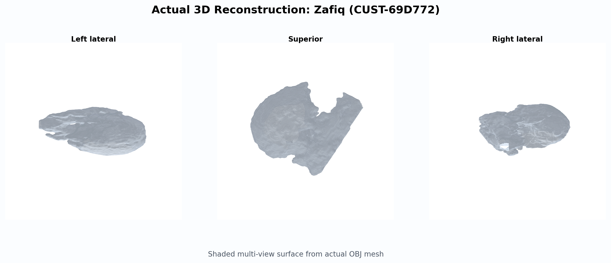
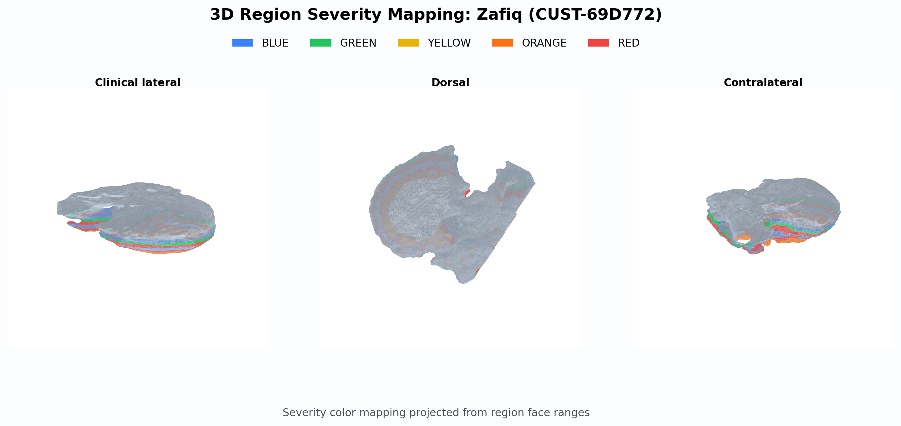
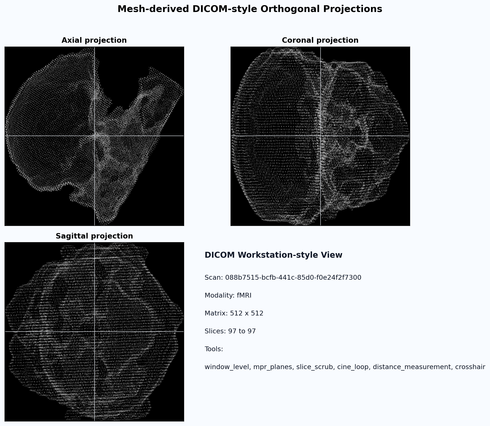
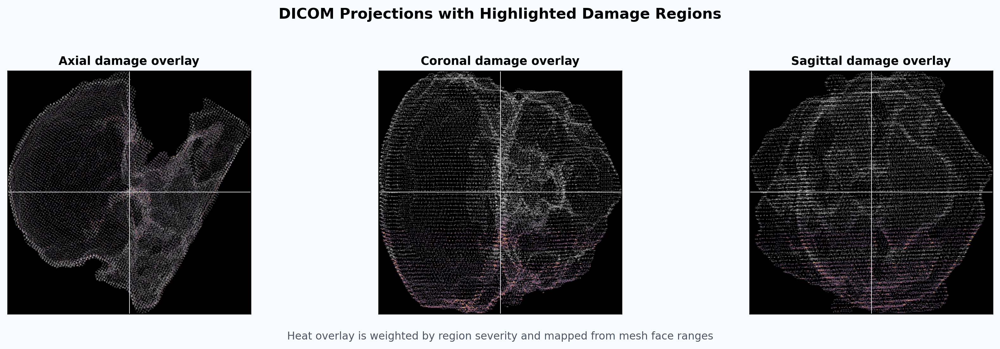

# Actual Reconstruction and DICOM Projection Gallery

These are real visualization outputs rendered from exported OBJ meshes and paired analysis metadata.

For the dedicated publication-style perfect-brain set with hotspot overlays and MRI-style panels, see: `perfect-brain-showcase/README.md`.

## Case Overview
- Zafiq (CUST-69D772) | scan 088b7515-bcfb-441c-85d0-f0e24f2f7300 | risk high | triage 16.30
- Uploaded Patient (UPLOAD-4B11D116) | scan 4b11d116-1e3e-4bef-a077-01f06d462523 | risk high | triage 17.60

## Case 1: Zafiq (CUST-69D772)
- Scan ID: 088b7515-bcfb-441c-85d0-f0e24f2f7300
- Mesh: outputs/export/088b7515-bcfb-441c-85d0-f0e24f2f7300/brain_xq_v2_web.obj
- Analysis: outputs/analysis/088b7515-bcfb-441c-85d0-f0e24f2f7300/analysis.json
- Case folder: cases/088b7515-bcfb-441c-85d0-f0e24f2f7300/README.md

### 3D Reconstruction Surface

### 3D Severity Region Marking

### DICOM Orthogonal Projections

### DICOM Damage Overlay

## Case 2: Uploaded Patient (UPLOAD-4B11D116)
- Scan ID: 4b11d116-1e3e-4bef-a077-01f06d462523
- Mesh: outputs/export/4b11d116-1e3e-4bef-a077-01f06d462523/brain_xq_v2_web.obj
- Analysis: outputs/analysis/4b11d116-1e3e-4bef-a077-01f06d462523/analysis.json
- Case folder: cases/4b11d116-1e3e-4bef-a077-01f06d462523/README.md

### 3D Reconstruction Surface

### 3D Severity Region Marking

### DICOM Orthogonal Projections

### DICOM Damage Overlay

