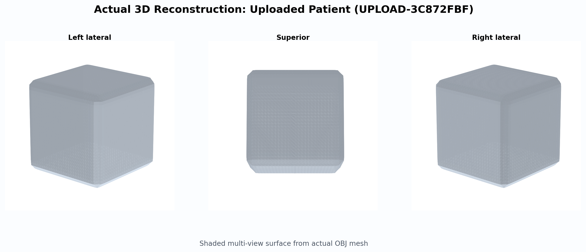
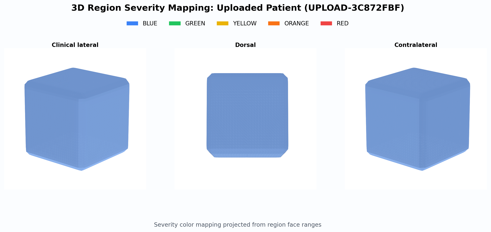
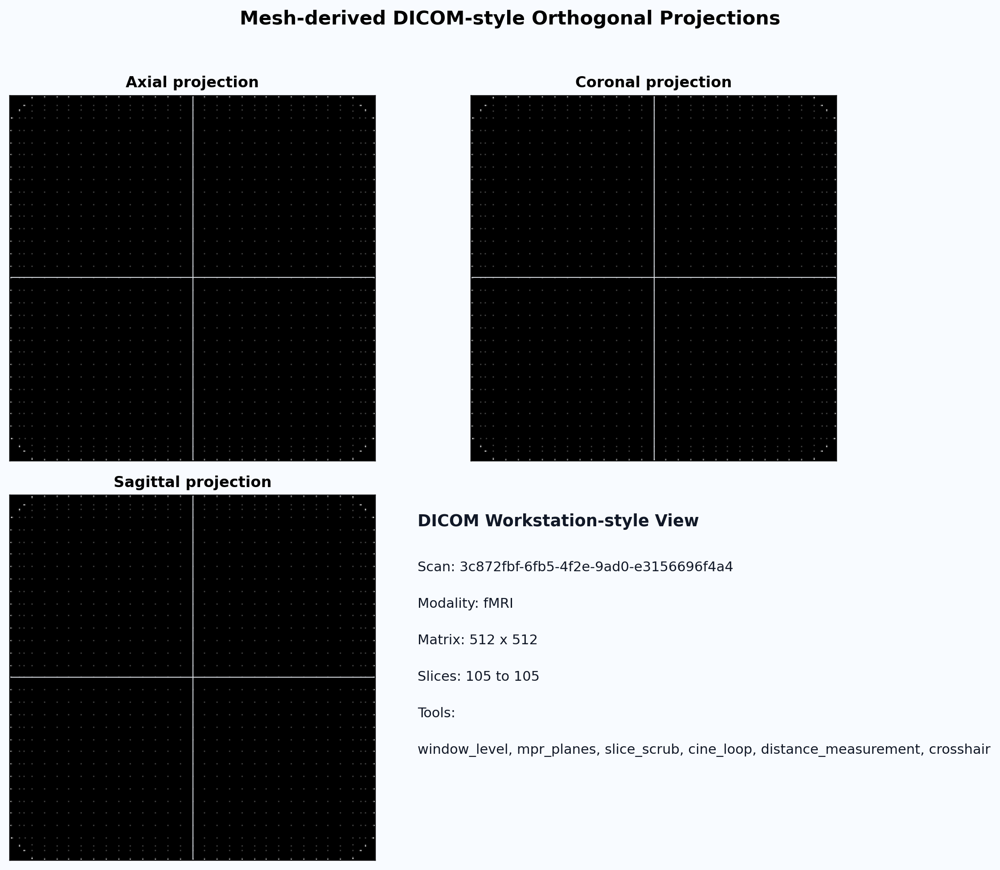
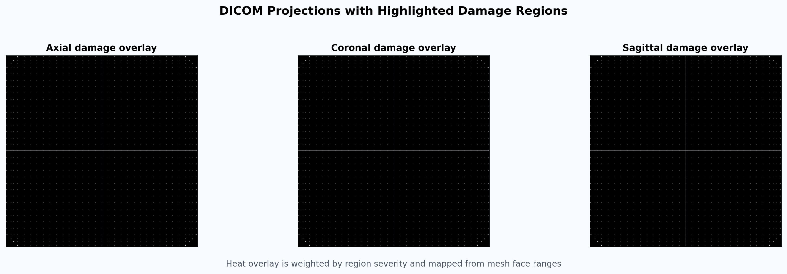

# Case Visuals: Uploaded Patient (UPLOAD-3C872FBF)

- Scan ID: 3c872fbf-6fb5-4f2e-9ad0-e3156696f4a4
- Risk band: low
- Triage score: 2.47
- Mesh source: outputs/export/3c872fbf-6fb5-4f2e-9ad0-e3156696f4a4/brain_hq_v2_web.obj
- Analysis source: outputs/analysis/3c872fbf-6fb5-4f2e-9ad0-e3156696f4a4/analysis.json
- Top burdened regions: Occipital_Sup_L (18.6%), Precentral_L (0.0%), Precentral_R (0.0%)

## 1) 3D Reconstruction Surface

## 2) 3D Reconstruction with Region Severity Marking

## 3) DICOM-style Orthogonal Projections

## 4) DICOM Damage Highlight Overlay

## Files
- 3d_reconstruction.png
- 3d_reconstruction.svg
- 3d_region_marking.png
- 3d_region_marking.svg
- dicom_projections.png
- dicom_projections.svg
- dicom_damage_overlay.png
- dicom_damage_overlay.svg
