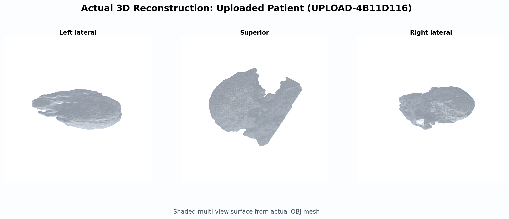
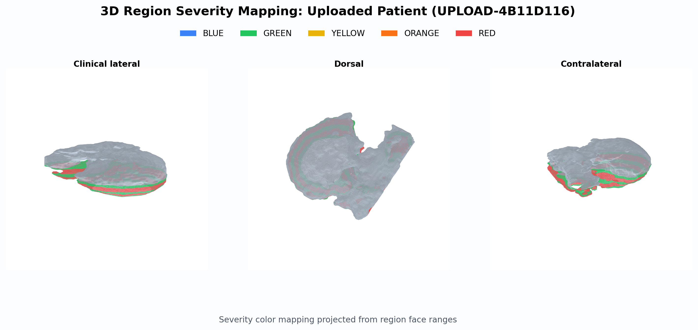
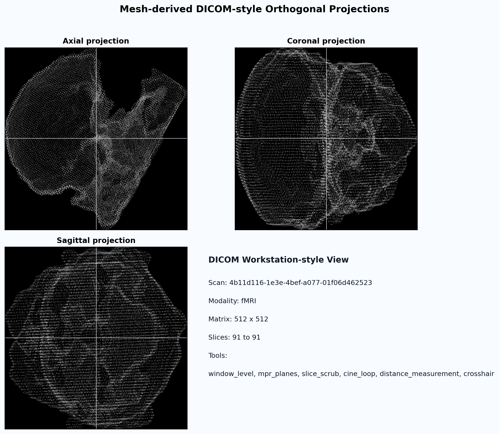
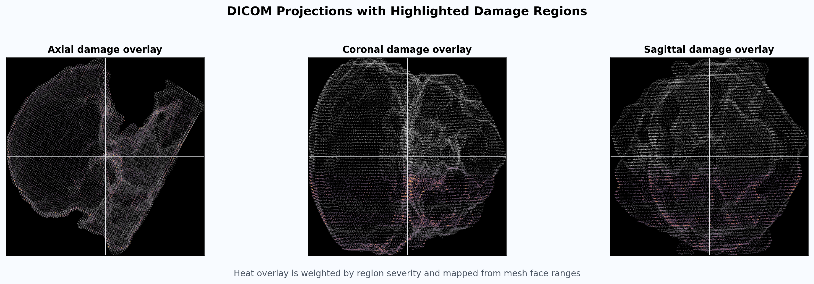

# Case Visuals: Uploaded Patient (UPLOAD-4B11D116)

- Scan ID: 4b11d116-1e3e-4bef-a077-01f06d462523
- Risk band: high
- Triage score: 17.60
- Mesh source: outputs/export/4b11d116-1e3e-4bef-a077-01f06d462523/brain_xq_v2_web.obj
- Analysis source: outputs/analysis/4b11d116-1e3e-4bef-a077-01f06d462523/analysis.json
- Top burdened regions: Parietal_Inf_L (32.8%), Hippocampus_L (32.1%), Temporal_Mid_L (31.9%)

## 1) 3D Reconstruction Surface

## 2) 3D Reconstruction with Region Severity Marking

## 3) DICOM-style Orthogonal Projections

## 4) DICOM Damage Highlight Overlay

## Files
- 3d_reconstruction.png
- 3d_reconstruction.svg
- 3d_region_marking.png
- 3d_region_marking.svg
- dicom_projections.png
- dicom_projections.svg
- dicom_damage_overlay.png
- dicom_damage_overlay.svg
